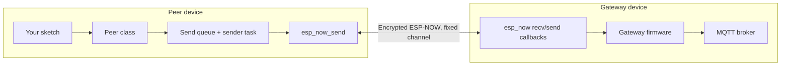

# Architecture

## Topology: one peer, one gateway

Each peer built with this library talks to exactly **one** gateway MAC address, on one fixed Wi-Fi channel, over one encrypted ESP-NOW link. There is no dynamic peer discovery, no mesh, and no broadcast — `Peer::init()` calls `esp_now_add_peer()` a single time, for the gateway.

This is a deliberate simplification: it keeps the peer firmware small (a static queue, one task, one peer table entry) and keeps the security model simple (one PMK, one per-peer LMK).

## Layers inside the library

1. **`Types.h` — wire format.** `EspNowMessage` is a `packed` struct: a `MessageType` discriminator followed by a `union` of per-type payload structs. Because it's a plain `union`, `sizeof(EspNowMessage)` is fixed regardless of which message type is stored, and `onRecieve` validates every incoming frame against exactly that size before touching it.

2. **`Utils.h` — parsing/validation.** Converts the human-readable PMK/LMK hex strings and MAC address strings passed in `PeerConfig` into the raw byte arrays ESP-NOW's API expects, and rejects malformed input before it reaches the radio layer.

3. **`EspNowMessageQueue.h` — delivery.** A `QueueMessage` (destination MAC + raw payload bytes + length + retry counter) is pushed onto a **statically allocated** FreeRTOS queue (`ESP_NOW_MAX_QUEUE_SIZE` slots). A dedicated `senderTask` blocks on the queue and calls `esp_now_send()`, retrying with a fixed backoff when the call is rejected locally.

4. **`Peer.h` — public API and protocol logic.** The `Peer` class owns the ESP-NOW lifecycle (`init`), the outbound message builders (`mqttMessage`, `notificationMessage`, `timeSyncMessage`, `sleepyDataMessage`, `sleepyCommandMessage`, `wolMessage`, `metricMessage`), the time-sync state machine (`timeSync`), and the inbound frame dispatcher (`onRecieve`).

## Security model

- **PMK (Primary Master Key):** installed once via `esp_now_set_pmk()`. Shared across the whole deployment; it's what ESP-NOW uses to encrypt the key exchange for per-peer session keys.
- **LMK (Local Master Key):** set per peer entry (`peerInfo.lmk`) with `peerInfo.encrypt = true`. This is the actual payload encryption key between this specific peer and the gateway.
- Both keys are supplied as 32-character hex strings in `PeerConfig` and converted to 16 raw bytes by `keyHexToBytes()`. See [Security](./security) for details and caveats.

## Identity: why the peer overrides its own MAC

`Peer::init()` calls `esp_wifi_set_mac(WIFI_IF_STA, peerMac)` before starting ESP-NOW. Rather than relying on the SoC's factory-burned MAC, the peer's on-air identity is whatever `PeerConfig::peerMac` specifies. This lets you assign stable, human-chosen addresses to devices (useful for provisioning and for matching gateway-side peer tables) independent of the physical hardware.

## Inbound message dispatch

`onRecieve` is registered once with `esp_now_register_recv_cb`. Every incoming frame is:

1. Size-checked against `sizeof(EspNowMqttGateway::EspNowMessage)` — anything else is logged and dropped.
2. Cast to `EspNowMessage*` and switched on `msg->type`.
3. Routed to one of three current behaviors:
   - `TEXT_MESSAGE` → copied into static buffers and handed to your `handleRecieve(topic, text)` callback.
   - `TIME_SYNC_MESSAGE` → applied directly to the system clock/timezone (see [Time Synchronization](./time-sync)).
   - `SLEEPY_COMMAND_MESSAGE` → copied into a static buffer and handed to your `handleCommand(text)` callback.
   - Anything else → logged as an unknown type and otherwise ignored.

Outbound-only message types (`NOTIFICATION_MESSAGE`, `SLEEPY_DATA_MESSAGE`, `WOL_MESSAGE`, `METRIC_MESSAGE`) currently have no corresponding inbound case — see the note in [API Reference → Peer](./api-reference/peer#inbound-dispatch-onrecieve) and [Troubleshooting](./troubleshooting).

## Sending: decoupled from the radio

Application code never calls `esp_now_send()` directly. Every `Peer::*Message()` method:

1. Builds an `EspNowMessage` on the stack.
2. Fills in the relevant union member with `strlcpy`/`memcpy`, respecting the configured buffer sizes.
3. Calls `enqueueMessage(gatewayMac, &msg, sizeof(EspNowMessage))`.

`enqueueMessage` is non-blocking (`xQueueSend(..., 0)`): if the queue is full, or the message is larger than `ESP_NOW_MAX_PAYLOAD_SIZE`, it returns `false` immediately rather than stalling the caller. See [Message Queue & Delivery](./message-queue) for the retry/backoff behavior once a message is queued.
