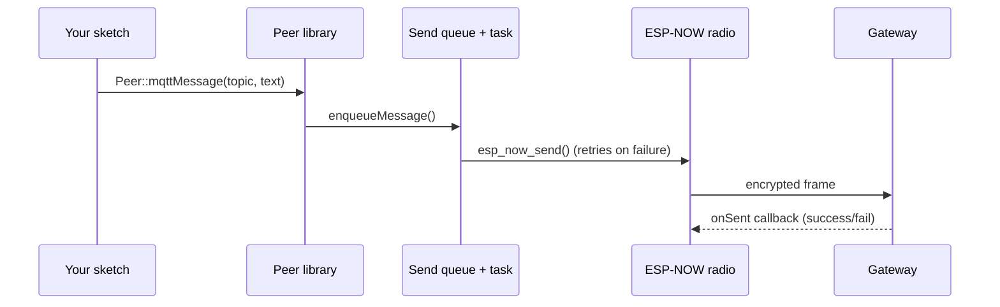

# ESP-NOW MQTT Gateway — Peer Library

The **Peer Library** is the piece of firmware that runs on every "leaf" device in an ESP-NOW MQTT Gateway deployment. It lets a battery-powered or mains-powered ESP32 talk to a single dedicated **gateway** node over encrypted [ESP-NOW](https://www.espressif.com/en/solutions/low-power-solutions/esp-now) links, without needing its own Wi-Fi credentials, MQTT client, or TLS stack.

The gateway is responsible for translating these ESP-NOW frames into MQTT topics/payloads (and back). The Peer Library is only concerned with the ESP-NOW side: framing messages, encrypting them, queueing and retrying delivery, and keeping the peer's clock in sync with the gateway.

## Why this exists

Running a full Wi-Fi + MQTT + TLS stack on every sensor node is expensive in flash, RAM, and power. ESP-NOW is connectionless, low-latency, and cheap to keep alive on battery-powered nodes. This library standardizes:

- A **single encrypted link** between each peer and its gateway (no broadcast, no mesh routing).
- A **fixed, versioned message envelope** so peer firmware and gateway firmware can evolve independently.
- A **queue + retry sender** so application code never blocks on radio conditions.
- A **time-sync mechanism** so peers keep a usable wall clock without an RTC or NTP client of their own.

## What the library gives you

| Capability | Provided by |
|---|---|
| ESP-NOW init, encryption, and peer registration | `Peer::init()` |
| Send free-form MQTT text (topic + payload) | `Peer::mqttMessage()` |
| Send a push notification | `Peer::notificationMessage()` |
| Ask the gateway for the current time/timezone | `Peer::timeSyncMessage()` / `Peer::timeSync()` |
| Send telemetry from a device that then sleeps | `Peer::sleepyDataMessage()` |
| Poll the gateway for a pending command | `Peer::sleepyCommandMessage()` |
| Trigger Wake-on-LAN on a target machine | `Peer::wolMessage()` |
| Push a Grafana/metrics payload | `Peer::metricMessage()` |
| Non-blocking, retrying delivery | `EspNowMessageQueue.h` |

## How a message flows

Incoming frames (time sync answers, commands) arrive asynchronously through `esp_now_register_recv_cb`, are decoded by their `MessageType`, and handed to callbacks that **your** application supplies (`handleRecieve`, `handleCommand`).

## Requirements

- ESP32 Arduino core (uses `esp_now.h`, `esp_wifi.h`, `WiFi.h`)
- FreeRTOS (bundled with the ESP32 core) — the sender uses a static queue and a dedicated task
- A gateway device running the matching ESP-NOW MQTT Gateway firmware, sharing the same PMK and channel

## Where to go next

- [Installation](./installation) — adding the library to your project
- [Quick Start](./quick-start) — the smallest working peer sketch
- [Architecture](./architecture) — how the pieces fit together
- [API Reference](./api-reference/peer) — full method-by-method reference
