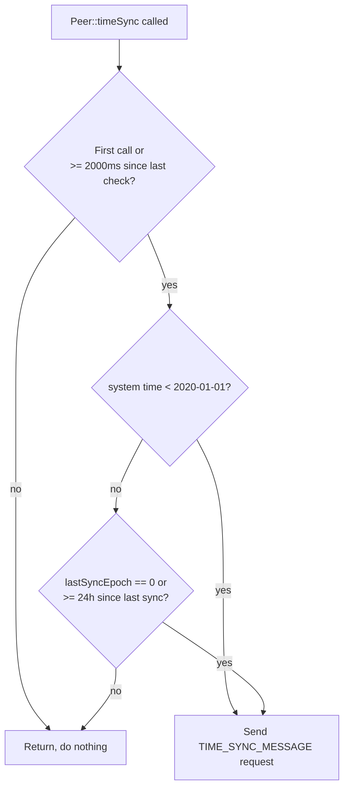

# Time Synchronization

Peer devices have no NTP client and, typically, no battery-backed RTC. The library keeps a usable wall clock by asking the gateway for the time over the same encrypted ESP-NOW link used for everything else.

## Calling convention

Call `Peer::timeSync()` from your main loop:

```cpp
void loop() {
  Peer::timeSync();
  // ... your other logic
}
```

It's safe (and intended) to call this on every iteration of `loop()` — it self-throttles internally and does almost nothing on most calls.

## The state machine

`Peer::timeSync()` uses `static` locals to track its own throttling, so this state persists across calls but is private to the function:

1. **Rate limit:** unless this is the very first call, it does nothing until at least 2000 ms (`CHECK_INTERVAL`) have passed since the last check.
2. **Unsynced clock check:** reads the current system time (`time(&now)`). If `now < 1577836800` (2020-01-01 00:00:00 UTC) — i.e., the clock still looks like it's at its power-on default — it logs `"Time not synced → starting sync"` and calls `timeSyncMessage()` to request a sync, then returns.
3. **Periodic resync:** if the clock looks plausible, it checks `Peer::lastSyncEpoch`. If it's `0` (never successfully synced) or at least 86400 seconds (24 hours) have elapsed since the last sync, it logs `"24h elapsed or first sync → requesting time sync"` and calls `timeSyncMessage()` again.



## The request/response round trip

1. `timeSyncMessage()` builds and enqueues an **empty** `EspNowMessage` of type `TIME_SYNC_MESSAGE` — it carries no epoch or timezone, it's purely a request marker.
2. The gateway is expected to reply with its own `TIME_SYNC_MESSAGE`, this time populated with `epoch` (seconds since the Unix epoch) and `timezonePosix` (a POSIX TZ string, e.g. `"CET-1CEST,M3.5.0,M10.5.0/3"`).
3. On the peer, `onRecieve` handles the reply:

```cpp
case TIME_SYNC_MESSAGE: {
  uint32_t epoch = msg->payload.timeSyncEspNowMessage.epoch;
  strlcpy(Peer::timezonePosix, msg->payload.timeSyncEspNowMessage.timezonePosix, TIMEZONE_POSIX_SIZE);

  struct timeval tv = { .tv_sec = epoch, .tv_usec = 0 };
  settimeofday(&tv, nullptr);

  setenv("TZ", Peer::timezonePosix, 1);
  tzset();

  Peer::lastSyncEpoch = epoch;
  printCurrentTime();
  break;
}
```

This directly sets the system clock (`settimeofday`) and the process timezone (`setenv("TZ", ...)` + `tzset()`), then remembers the epoch in `Peer::lastSyncEpoch` so the next `timeSync()` call knows how long it's been.

## Reading the time and timezone elsewhere in your sketch

Because `TIME_SYNC_MESSAGE` handling calls the standard `settimeofday`/`setenv`/`tzset` functions, any standard C time call reflects the synced clock and timezone afterwards:

```cpp
time_t now;
time(&now);
struct tm local;
localtime_r(&now, &local);
```

You can also inspect `Peer::timezonePosix` and `Peer::lastSyncEpoch` directly, or call `printCurrentTime()` from `Utils.h` to log both UTC and local time.

## Things to keep in mind

- Until the first successful sync, `Peer::timezonePosix` defaults to `"UTC0"` and the system clock is whatever the SoC booted with (usually the Unix epoch or close to it) — this is exactly what the `< 1577836800` check is designed to detect.
- A device that reboots loses its synced time and starts the "unsynced clock" path again on the next `timeSync()` call.
- `timeSyncMessage()` goes through the same queue as every other message type — if the queue is full or the gateway is unreachable, the request is simply not delivered, and the peer will naturally retry again on the next throttled check.
